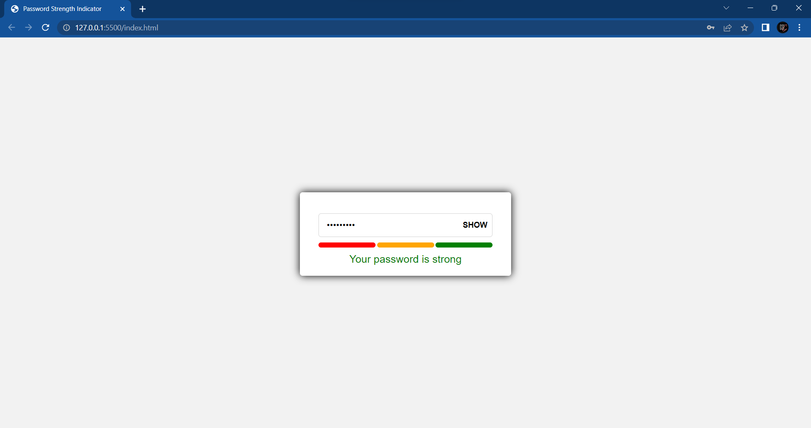
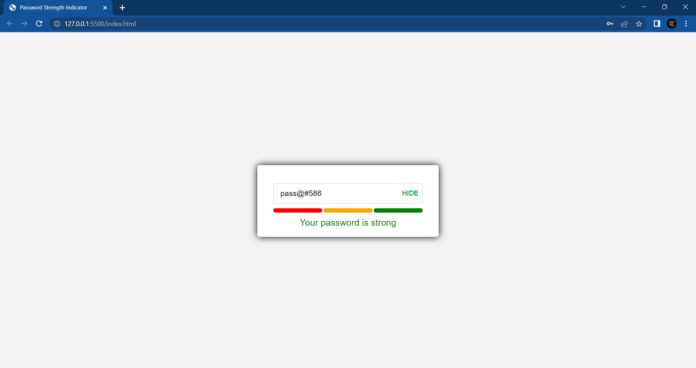

# Password Strength Indicator

## Description

A tool or feature that helps users determine the strength of their passwords. It uses regular expressions to check the password strength and displays a strength indicator bar that changes color according to the strength of the password and shows a text message that tells the password is weak, medium or strong. You can integrate this project with webpages, forms or anywhere you want.

## Technologies Used

* HTML
* CSS
* JavaScript

## Installation

1. Clone the repository <a href="https://github.com/Thirumalaikumar-M/password-strength-indicator.git">https://github.com/Thirumalaikumar-M/password-strength-indicator.git</a>
2. Open `index.html` in your preferred web browser
3. You can also integrate this project with your webpages, forms, etc,..

## Features

* Password strength indicator bar that changes color based on the strength of the password

* Displays a message indicating the strength of the password.

* Show / hide password feature

## Usage

* Enter your password into the input field

* The strength indicator bar will change color based on the strength of your password

* A message indicating the strength of the password will be displayed

* You can toggle the visibility of your password by clicking the "SHOW" and "HIDE" buttons

## Screenshots

## Github hosted page

Try the <a href="https://thirumalaikumar-m.github.io/password-strength-indicator/">Github hosted page</a>

## Contributions

If you'd like to contribute to the project, feel free to submit a pull request. You can also report any bugs or issues using the GitHub issue tracker.

## License

This project is released under the  Feel free to use, modify and distribute
